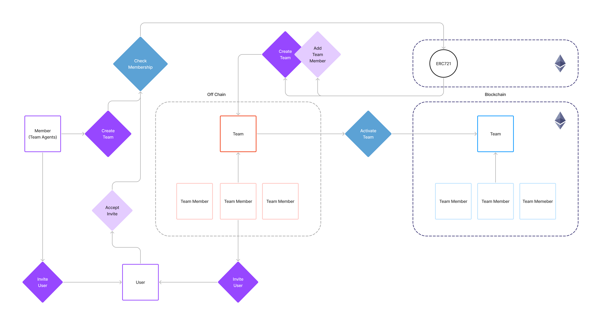
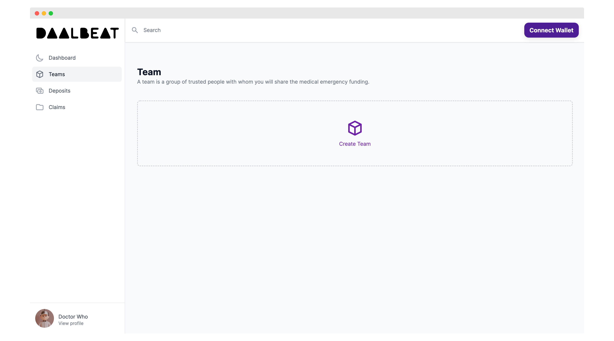
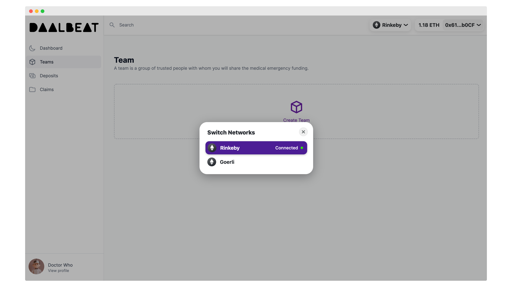
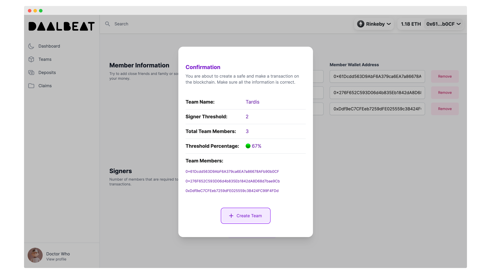
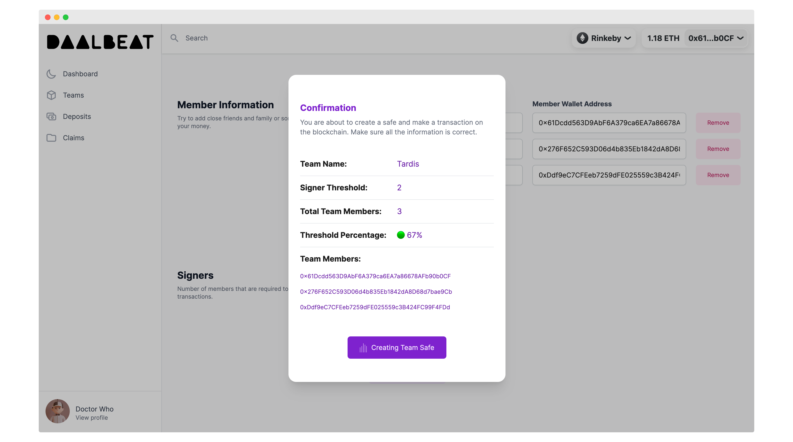

# Teams

## Team System Flow

A team is essentially a multisig that multiple teammates share.

## How to Create Team

[WIP] Currently in Alpha version...

### Step 1: Go to the Teams Page

### Step 2: Connect Your Wallet

### Step 3: Connect to Rinkeby

### Step 4: Fill Team Form

### Step 5: Validate Team Info

### Step 6: Create Team On-Chain

### Step 7: Team Created

